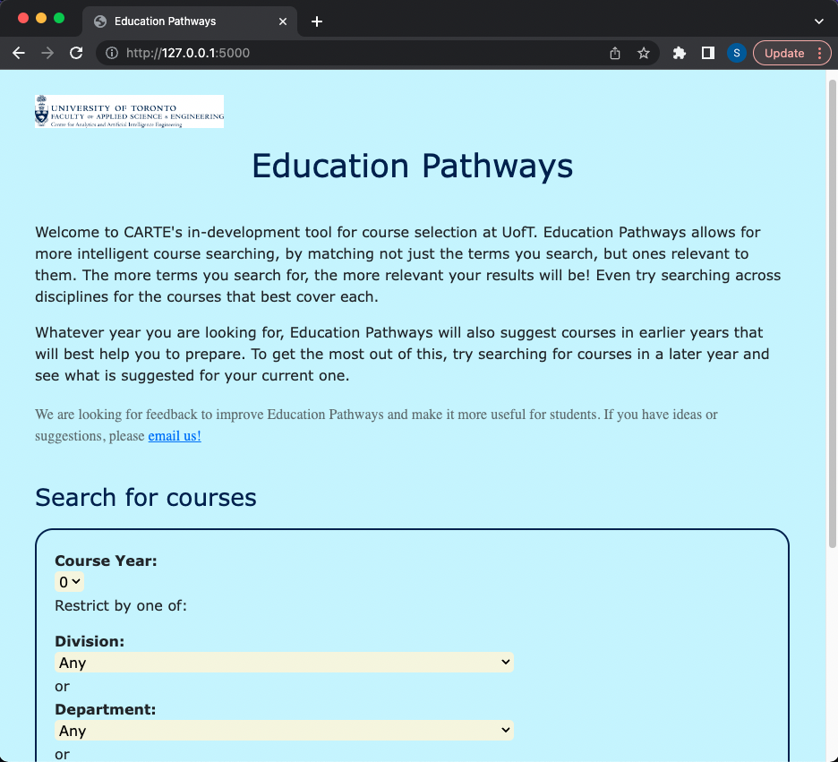
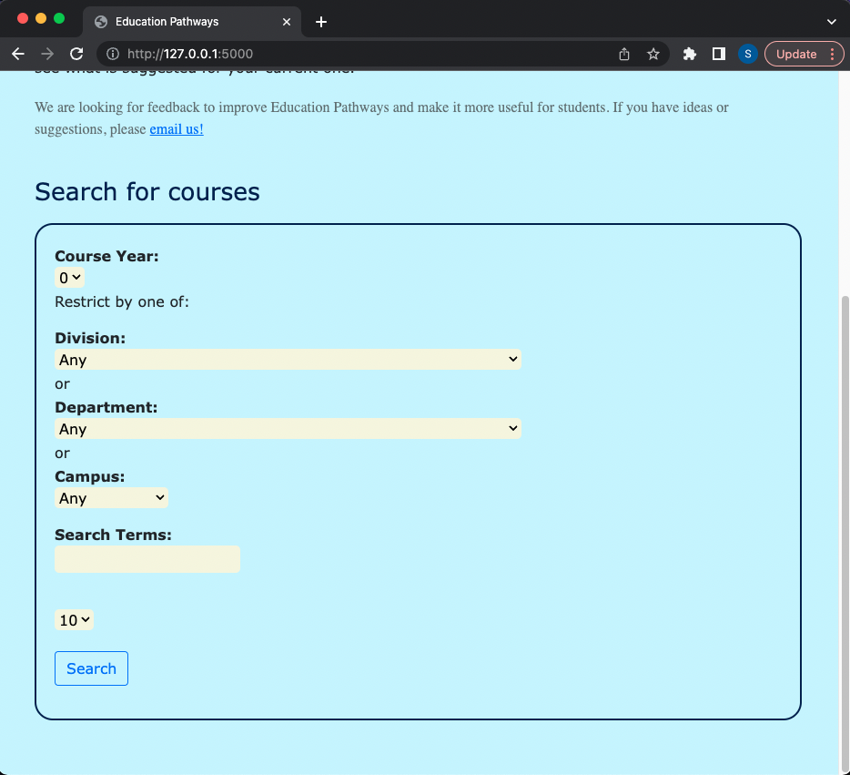
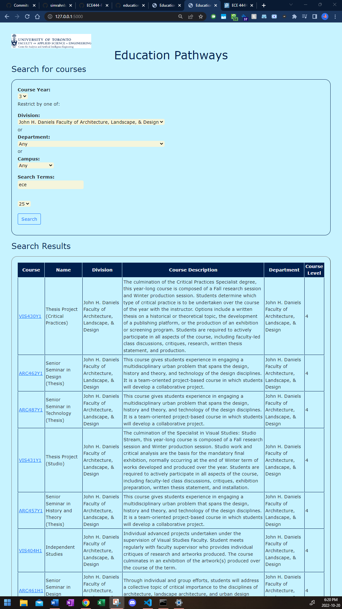
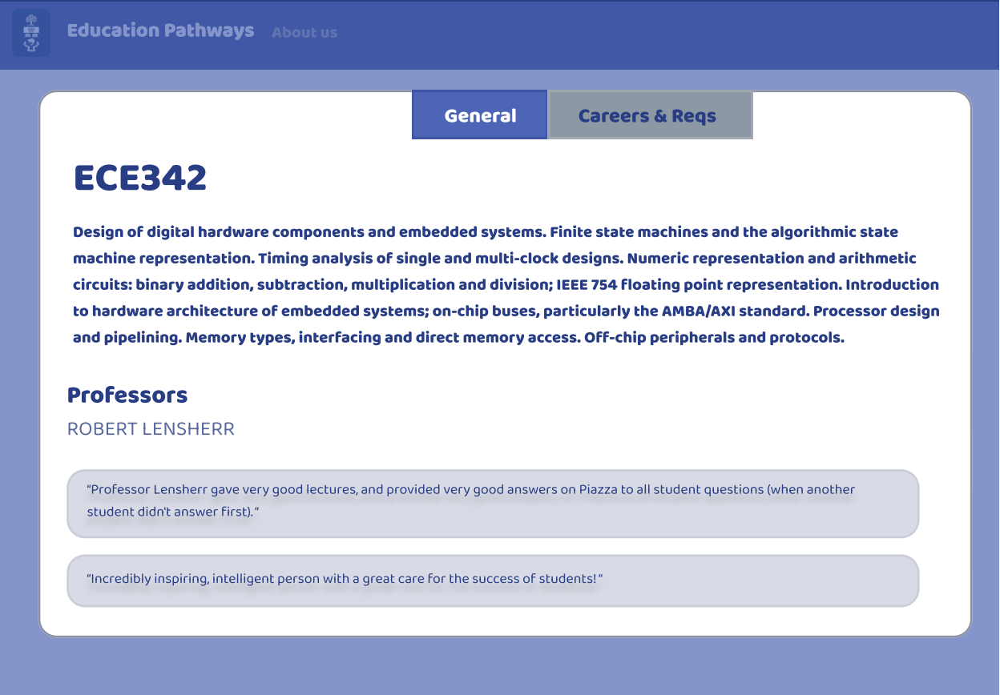
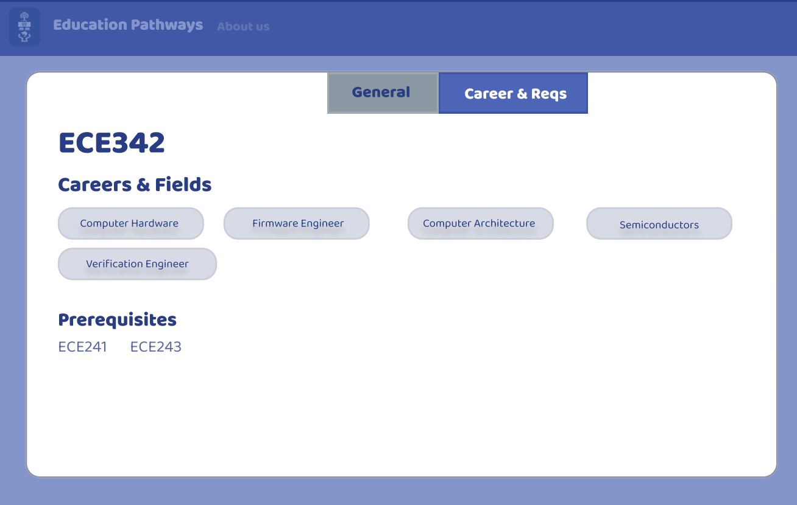
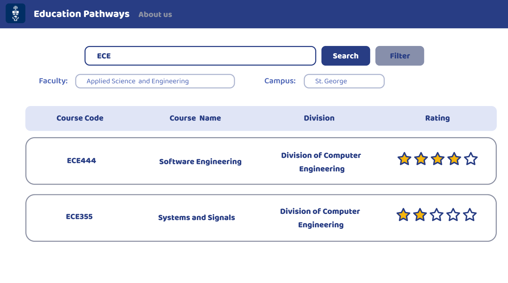

Name: Simrah Najeeb and Shaziah Gafur 

This repo is a clone of https://github.com/nelaturuk/education_pathways. 

### Activity 1 

### Activity 2-5 

### Activity 6 

User Story 1: As a student with goals of higher education, I hope that a course's description includes information such as the professors who teach the course, as well as the peer feedback on them. 

User Story 2: As a first-year student, I would like courses to display possible careers & fields that they can lead to. As part of this, I would also like to see any and all prerequisites. 

User Story 3: As a student who lives downtown & studies engineering, I want to only see courses that are offered by the faculty of engineering and that are available on the main campus. 

